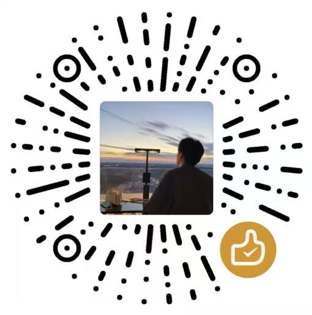

> [!NOTE]
> **2025年05月17日：更多新功能，请参考：<https://github.com/PagesX> 项目！**


# 一个基于 Hugo 的静态响应式网址导航主题 

本项目是基于**纯静态**的网址导航网站 [webstack.cc](https://github.com/WebStackPage/WebStackPage.github.io) 制作的 [Hugo](https://gohugo.io/) 主题，是一个基于 Hugo 的静态响应式网址导航主题。<br/>

## 主题开源地址

[**GitHub**](https://github.com/liuchenyang0703/nav) | [**Gitee**](暂无) | [**GitCode**](暂无)

## 主题演示地址

- 站点：<https://liuchenyang0703.github.io/nav/>
- 源码：<https://github.com/liuchenyang0703/nav>


## 特色功能

这是 Hugo 版 WebStack 主题。可以借助下面的平台直接托管部署，无需服务器。
- [Webify](https://webify.cloudbase.net/) | [Netlify](https://app.netlify.com/) | [Cloudflare Pages](https://pages.cloudflare.com) | [Vercel](https://vercel.com) | [Github Pages](https://pages.github.com/)

> 这里是在windows上跑完之后使用hugo.exe编译好之后吧public推送到github上的，就可以直接访问到了。

总体说一下特点：

- 采用了一直以来最喜欢的 Hugo 部署方式，方便高效。
- 主要的配置信息都集成到了 `config.toml`，一键完成各种自定义的配置。
- 导航的各个信息都集成在 `data/webstack.yml` 文件中，方便后续增删改动。
```yml
- taxonomy: 科研办公
  icon: fas fa-flask fa-lg
  list:
    - term: 生物信息
      links:
        - title: NCBI
          logo: ncbi.jpg
          url: https://www.ncbi.nlm.nih.gov/
          description: National Center for Biotechnology Information.
        - title: Bioconda
          logo: bioconda.jpg
          url: https://anaconda.org/bioconda/
          description: "Bioconda :: Anaconda.org."
    - term: 办公学习
      links:
        - title: 有道词典
          logo: 有道词典.png
          url: https://www.youdao.com/
          description: 免费，即时的多语种在线翻译。
        - title: 有道翻译
          logo: 有道词典.png
          url: http://fanyi.youdao.com/
          description: 有道翻译。
```
- 做了手机电脑自适应以及夜间模式。
- 增加了搜索功能，以及下拉的热词选项（基于百度 API）。
- 增加了一言、和风天气的 API 【和风天气：此版本好像不支持了已经】。

## 使用说明

这是一个开源的公益项目，你可以拿来制作自己的网址导航，也可以做与导航无关的网站。

WebStack 有非常多的魔改版本，这是其中一个。如果你对本主题进行了一些个性化调整，欢迎来本项目中 [issue](https://github.com/liuchenyang0703/nav/issues) 分享一下！


## 安装说明

关于 Windows/Linux 下详细的安装与使用说明，请参考文档。

📗 **《WebStack-Hugo | 一个静态响应式导航主题》** 
- [链接1 - GitHub Discussions](https://github.com/shenweiyan/Knowledge-Garden/discussions/10)


## 感谢

本主题的部分代码参考了以下几个开源项目，特此感谢。

- [WebStackPage/WebStackPage.github.io](https://github.com/WebStackPage/WebStackPage.github.io)
- [liutongxu/liutongxu.github.io](https://github.com/liutongxu/liutongxu.github.io)
- [iplaycode/webstack-hugo](https://github.com/iplaycode/webstack-hugo)
- [shenweiyan/WebStack-Hugo](https://github.com/shenweiyan/WebStack-Hugo)
- [liuchenyang0703/nav](https://github.com/liuchenyang0703/nav)

感谢以下所有朋友对本主题所做出的贡献。   
- [@shenweiyan](https://github.com/shenweiyan)

## 赞赏

如果你觉得本项目对你有所帮助，欢迎请作者喝杯热咖啡 >.<
| 微信| 支付宝|
|:--:|:--:|
|| |


## Star History

[](https://www.star-history.com/#liuchenyang0703/nav&Date)

